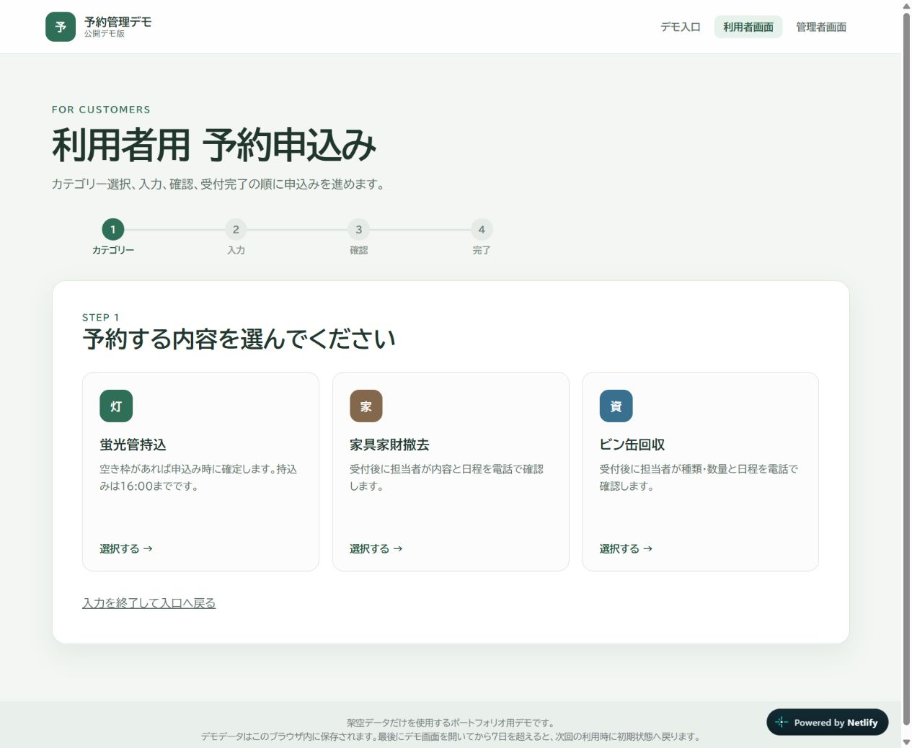
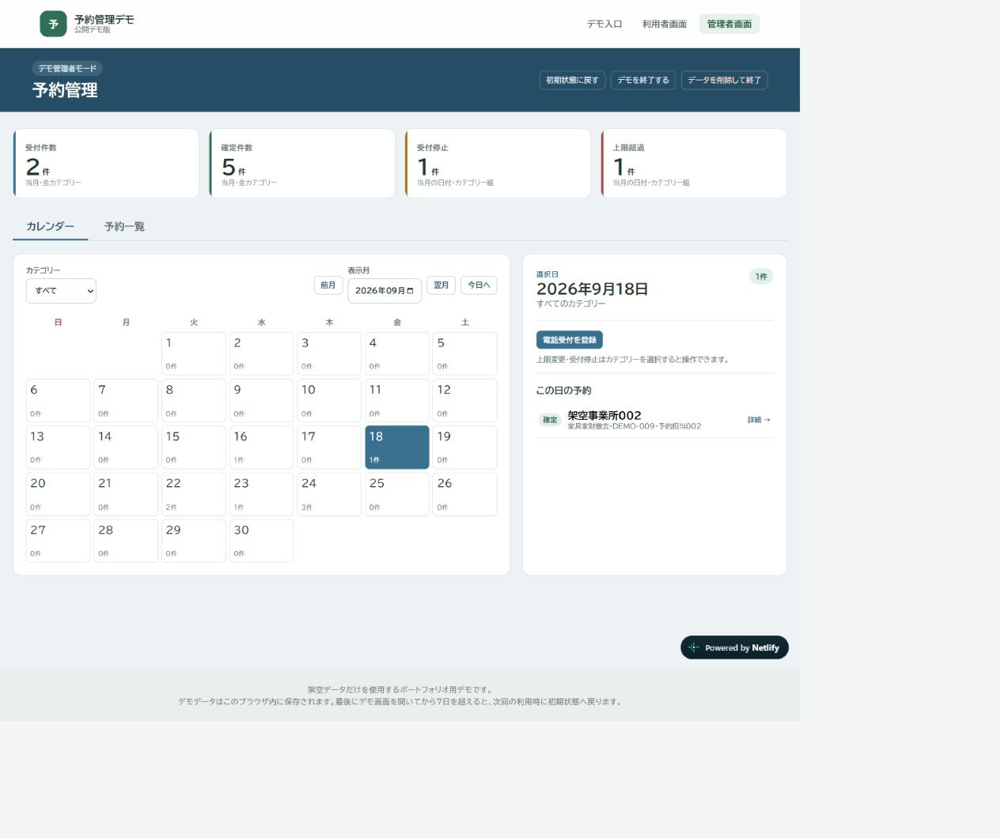
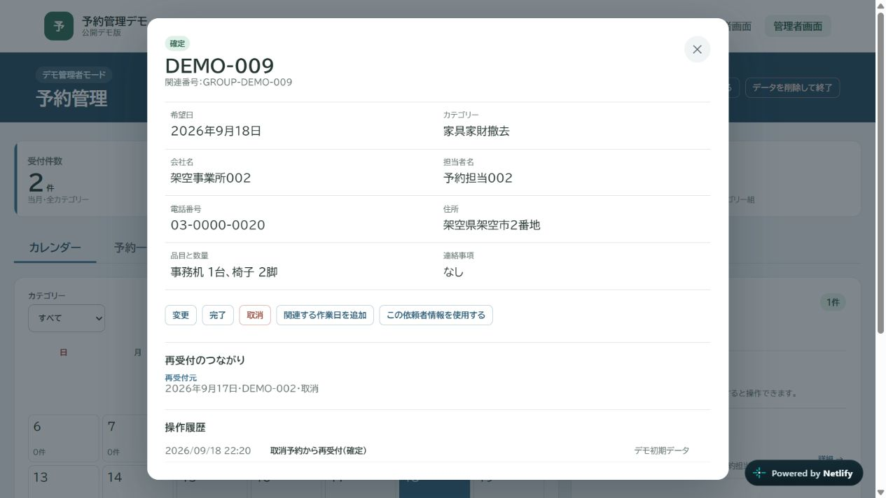

# 予約受付から変更履歴まで、一連の業務を試せる予約管理ツール

## 一覧カード用の紹介文

蛍光管持込・家具家財撤去・ビン缶回収を題材にした予約管理デモです。利用者の申込みから、管理者の電話受付、日程調整、変更・取消・再受付までを実装。カテゴリーごとの受付方法と予約枠を整理し、操作の経緯を履歴で確認できます。

## 詳しい紹介文

### 申込み後の対応まで含めて設計

予約フォームで受け付けた後にも、内容の確認や日程調整、変更への対応が続きます。この作品では、申込者が予約する画面と、受付担当者が管理する画面を用意し、その一連の流れをブラウザ上で試せるようにしました。

対象は蛍光管持込、家具家財撤去、ビン缶回収の3カテゴリーです。蛍光管持込は空き枠があれば申込み時に確定し、家具家財撤去とビン缶回収は電話で内容と日程を調整してから確定します。確認画面や受付完了後の案内にも、この違いを反映しています。

### 日程と対応状況を一つの画面で確認

管理者画面では、月間カレンダーと予約一覧を切り替え、カテゴリーや状態、会社名などで対象の予約を探せます。カテゴリーごとの日別上限と受付停止も設定でき、既存予約を残しながら新しい申込みを調整できます。

電話で受けた予約の登録、日付や内容の変更、確定・完了・取消にも対応しました。複数日にわたる作業は関連番号で結び、各日の予約枠と対応状態を個別に管理します。

### 取り消した予約の経緯を残す

取消後に依頼を受け直した場合は、元の予約を確定に戻さず、新しい予約を作ります。元予約と新予約の双方から関係を確認でき、履歴には再受付の結果が「受付」か「確定」かも表示します。

入力画面だけでなく、操作が重なった場合の保存処理にも取り組みました。同じ送信の繰り返しによる二重登録を防ぎ、古い画面から更新しようとした場合は競合を検出します。保存直前にも予約枠や受付停止を再確認する構成です。

### 公開デモとして試せる範囲

ReactとTypeScriptで画面と業務ルールを実装し、予約データはブラウザ内のIndexedDBに保存しています。同じブラウザの利用者画面と管理者画面でデータを共有し、複数タブへ変更を通知します。

初期状態には架空の予約9件が入っています。実在する会社名・氏名・住所・電話番号は入力せず、架空情報でお試しください。管理者画面の「初期状態に戻す」から、初期データを復元できます。

この作品は業務フローと操作を紹介する公開デモです。本番の認証や複数端末で共有するデータベース、顧客通知、決済・売上連携は含めていません。実業務での導入実績や作業時間の削減効果を示すものでもありません。

v1.0.0の確認では、自動テスト74件、型検査、Lint、本番ビルドが通りました。設計資料、実装、検査、公開までをつなげた制作例として紹介しています。

[公開デモを試す](https://reservation-tool-next-demo.netlify.app/) ／ [GitHubで実装を見る](https://github.com/skamatakiwriter-rgb/reservation-tool-next)
